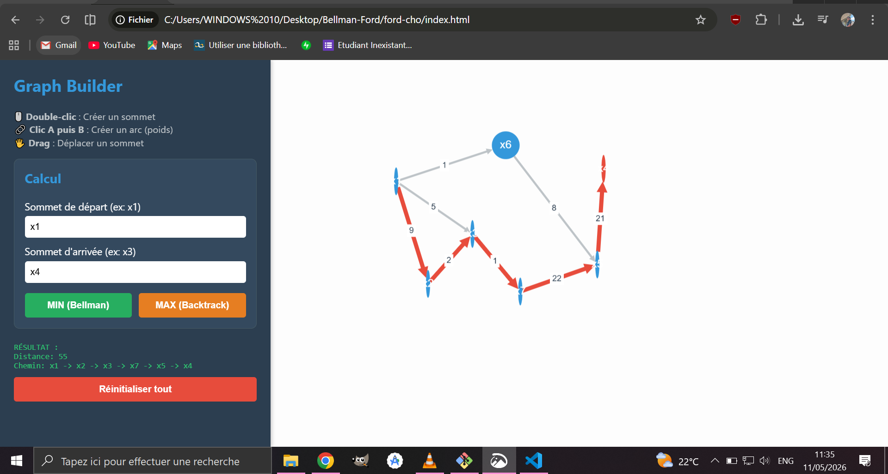
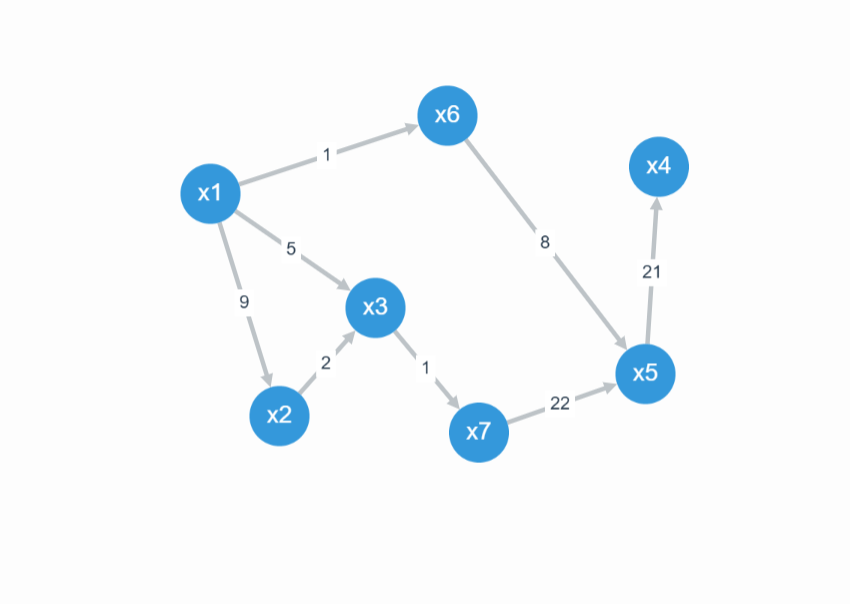
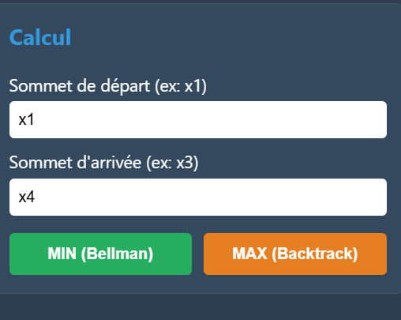
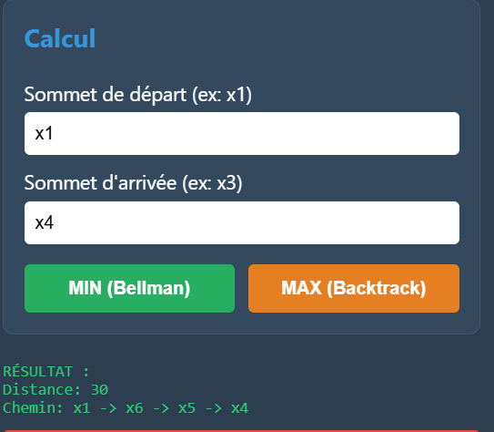
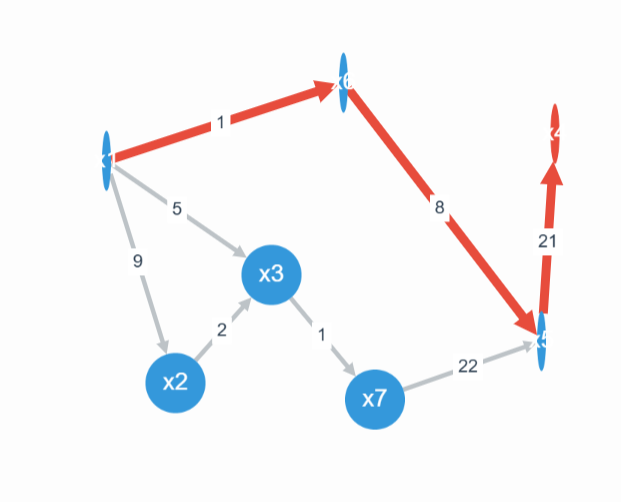
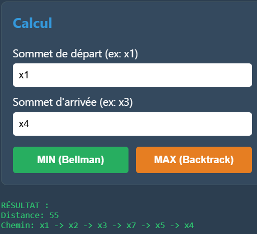
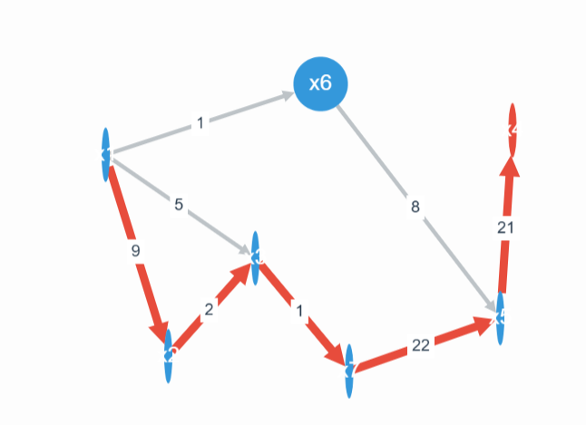

### Voici le guide l'utilisation 

#### 1- Premierement:
Vous faites un double clique pour creer un sommet, le sommet est numerotees par ordre et generer automatiquement

Une fois vous avez satisfais de votre sommet , vous selectionnez votre sommet vers le sommet qu'il redirige et vous pouvez entrer la valeur de l'arc.


#### 2- Deuxiement:
Vous saisissez le sommet de depart et sommet d'arriver comme vous voulez.


#### 3- Troisiement:
Vous pouvez maintenant, cliquer au bouton minimisation ou maximisation, selon votre besoin et vous obtiendrer le resultat
##### *MINIMISATION*



##### *MAXIMISATION*



**NB**: Le projet est libre , vous pouvez ameliorer
Pour copier le projet, vous pouvez telecharger en fichier .zip ou si vous avez deja git, il suffit just de cloner
```bash
git clone https://github.com/mariotFaah/ford-algorithm-chemin-optimal-js
```

laisser un **star** si vous aimez mon travail ;*